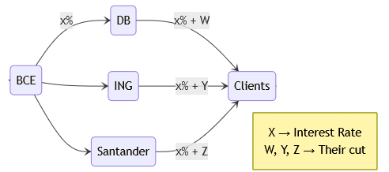
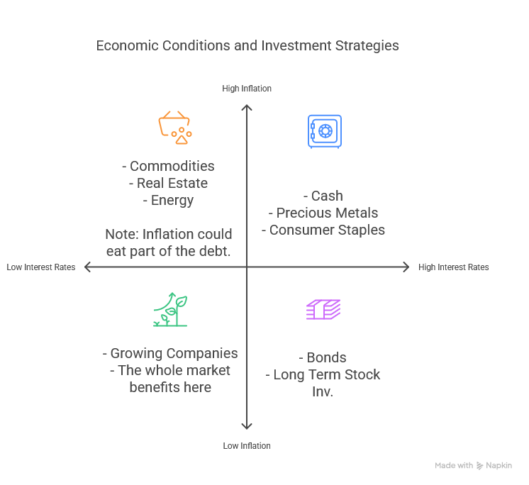

Rate at which the central bank lends money to the commercial banks.

Controlling these rates is the most common way to regulate the economy and the flow of money

## Basic Scenarios

### Interest Rise
- Borrowing money costs more and fewer credits are made
- Cash money is flowing, companies and people control their expenses
- Less spending slows down the economy
- Inflation tends to fall

### Interest Fall
- Borrowing is cheaper
- More money starts flowing and being spent/invested
- Inflation tends to rise

## Nominal Interest Rate vs. Real Interest Rate

### Nominal Interest Rate
 → The rate charged by the central banks

### Real Interest Rate
 → Nominal Interest Rate - Inflation
Note: the real rate could be negative and the inflation could eat part of the debt if the income grows parallel with it.

## Investments Depending on the Interest Rate

