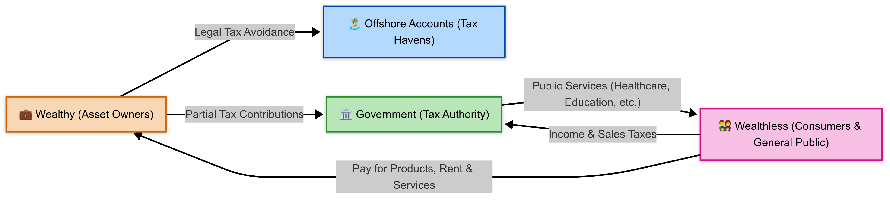

# Wealth Economics & Inequality

## Wealth

The capacity to own things, such as cars, houses, and any asset really.

## Wealthy Vs. Wealthless

| **Wealthy**                                                                                             | Wealthless                                                                                 |
| :------------------------------------------------------------------------------------------------------ | ------------------------------------------------------------------------------------------ |
| -Own a lot of things                                                                                    | -Own little. Nowadays many don’t even own cars or houses.                                  |
| -Their assets produce income for them. Their assets own/produce the essentials bought by the wealthless | -Job dependent. In some countries they rely heavily in an already overloaded social state. |
| -Their spending, even when nominally high, is just a minimal part of their income                       | -Spend a significant part of their income in essentials.                                   |
| -That extra income will be used to get more assets                                                      | -Have little to spend in non-essentials, including assets.                                 |

## Wealth Inequality

- Wages fell behind rising living and housing costs
- Jobs get concentrated in few places, and so do people that need them
- The middle class, which owned a good amount of assets is now shrinking. Think the U.S. and Europe between the 50s and 2000s

## The Economy in a Wealth Unequal World

- It has less regular spending in the sense that the wealthless live to cover essentials and the wealthy have a specific spending style
- In a low demand world, there is little incentive to invest in increasing production, so the wealthy spent in assets
- Stagnated production levels and better technologies reduce the need for workers.

		Less Jobs + More People = Lower Wages

		More people + House Ownership in Few Hands = Higher Housing Prices

So:

		Lower wages + High Housing Cost → Few Own Houses → High Insecurity

- Places with few wealthy people can barely have an "essentials" economy.

- Taxes reach a dead-end as the wealthless cant carry the burden alone and the wealthy have the means to legally pay less taxes. So the **government must be austere and public services lose quality.**

## Solutions?

1. Bring the "avoided taxes" back into the economy

2. The wealthy are forced to start spending more so the economy starts moving
   
Neither of which will happen on its own. Government needs to push for them. However, the 2nd approach is more "wealthy friendly" and has better chances.
    
Example: Laws to force the sale of physical assets after 150 years. This puts the assets again in the market, generates sale taxes and still allow the wealthy to profit from them for almost 3 generations

----------------------------

Source: Gary Stevenson - https://www.wealtheconomics.org/